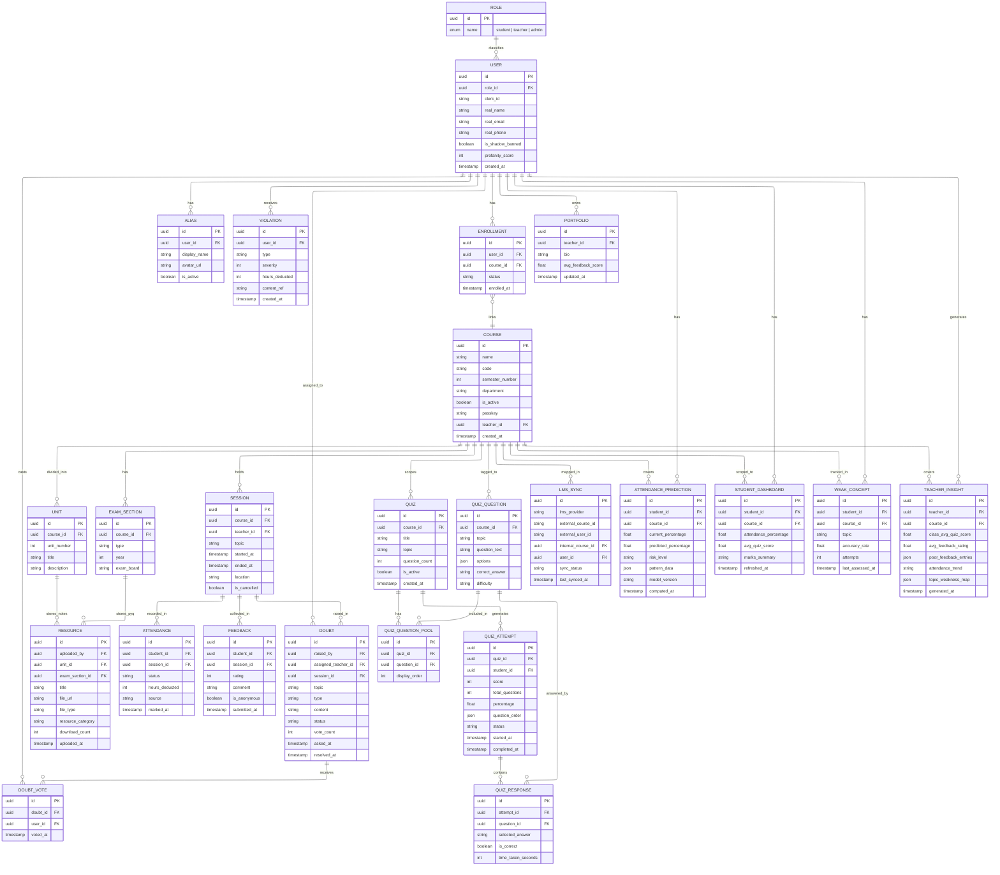

```mermaid
---
config:
  layout: elk
---
erDiagram
ROLE {
  uuid id PK
  enum name  "student | teacher | admin"
}

  USER {
    uuid id PK
    uuid role_id FK
    string clerk_id
    string real_name
    string real_email
    string real_phone
    boolean is_shadow_banned
    int profanity_score
    timestamp created_at
  }

  ALIAS {
    uuid id PK
    uuid user_id FK
    string display_name
    string avatar_url
    boolean is_active
  }

  VIOLATION {
    uuid id PK
    uuid user_id FK
    string type
    int severity
    int hours_deducted
    string content_ref
    timestamp created_at
  }

  COURSE {
    uuid id PK
    string name
    string code
    int semester_number
    string department
    boolean is_active
    string passkey
    uuid teacher_id FK
    timestamp created_at
  }

  ENROLLMENT {
    uuid id PK
    uuid user_id FK
    uuid course_id FK
    string status
    timestamp enrolled_at
  }

  PORTFOLIO {
    uuid id PK
    uuid teacher_id FK
    string bio
    float avg_feedback_score
    timestamp updated_at
  }

  UNIT {
    uuid id PK
    uuid course_id FK
    int unit_number
    string title
    string description
  }

  EXAM_SECTION {
    uuid id PK
    uuid course_id FK
    string type
    int year
    string exam_board
  }

  RESOURCE {
    uuid id PK
    uuid uploaded_by FK
    uuid unit_id FK
    uuid exam_section_id FK
    string title
    string file_url
    string file_type
    string resource_category
    int download_count
    timestamp uploaded_at
  }

  SESSION {
    uuid id PK
    uuid course_id FK
    uuid teacher_id FK
    string topic
    timestamp started_at
    timestamp ended_at
    string location
    boolean is_cancelled
  }

  ATTENDANCE {
    uuid id PK
    uuid student_id FK
    uuid session_id FK
    string status
    int hours_deducted
    string source
    timestamp marked_at
  }

  FEEDBACK {
    uuid id PK
    uuid student_id FK
    uuid session_id FK
    int rating
    string comment
    boolean is_anonymous
    timestamp submitted_at
  }

  DOUBT {
    uuid id PK
    uuid raised_by FK
    uuid assigned_teacher_id FK
    uuid session_id FK
    string topic
    string type
    string content
    string status
    int vote_count
    timestamp asked_at
    timestamp resolved_at
  }

  DOUBT_VOTE {
    uuid id PK
    uuid doubt_id FK
    uuid user_id FK
    timestamp voted_at
  }

  QUIZ {
    uuid id PK
    uuid course_id FK
    string title
    string topic
    int question_count
    boolean is_active
    timestamp created_at
  }

  QUIZ_QUESTION {
    uuid id PK
    uuid course_id FK
    string topic
    string question_text
    json options
    string correct_answer
    string difficulty
  }

  QUIZ_QUESTION_POOL {
    uuid id PK
    uuid quiz_id FK
    uuid question_id FK
    int display_order
  }

  QUIZ_ATTEMPT {
    uuid id PK
    uuid quiz_id FK
    uuid student_id FK
    int score
    int total_questions
    float percentage
    json question_order
    string status
    timestamp started_at
    timestamp completed_at
  }

  QUIZ_RESPONSE {
    uuid id PK
    uuid attempt_id FK
    uuid question_id FK
    string selected_answer
    boolean is_correct
    int time_taken_seconds
  }

  LMS_SYNC {
    uuid id PK
    string lms_provider
    string external_course_id
    string external_user_id
    uuid internal_course_id FK
    uuid user_id FK
    string sync_status
    timestamp last_synced_at
  }

  ATTENDANCE_PREDICTION {
    uuid id PK
    uuid student_id FK
    uuid course_id FK
    float current_percentage
    float predicted_percentage
    string risk_level
    json pattern_data
    string model_version
    timestamp computed_at
  }

  STUDENT_DASHBOARD {
    uuid id PK
    uuid student_id FK
    uuid course_id FK
    float attendance_percentage
    float avg_quiz_score
    string marks_summary
    timestamp refreshed_at
  }

  WEAK_CONCEPT {
    uuid id PK
    uuid student_id FK
    uuid course_id FK
    string topic
    float accuracy_rate
    int attempts
    timestamp last_assessed_at
  }

  TEACHER_INSIGHT {
    uuid id PK
    uuid teacher_id FK
    uuid course_id FK
    float class_avg_quiz_score
    float avg_feedback_rating
    json poor_feedback_entries
    string attendance_trend
    json topic_weakness_map
    timestamp generated_at
  }

  ROLE ||--o{ USER : classifies
  USER ||--o{ ALIAS : has
  USER ||--o{ VIOLATION : receives
  USER ||--o{ ENROLLMENT : has
  USER ||--o{ PORTFOLIO : owns
  ENROLLMENT }o--|| COURSE : links

  COURSE ||--o{ SESSION : holds
  COURSE ||--o{ LMS_SYNC : mapped_in
  COURSE ||--o{ UNIT : divided_into
  COURSE ||--o{ EXAM_SECTION : has
  COURSE ||--o{ QUIZ : scopes
  COURSE ||--o{ QUIZ_QUESTION : tagged_to
  COURSE ||--o{ WEAK_CONCEPT : tracked_in

  UNIT ||--o{ RESOURCE : stores_notes
  EXAM_SECTION ||--o{ RESOURCE : stores_pyq

  SESSION ||--o{ ATTENDANCE : recorded_in
  SESSION ||--o{ FEEDBACK : collected_in
  SESSION ||--o{ DOUBT : raised_in

  DOUBT ||--o{ DOUBT_VOTE : receives
  USER ||--o{ DOUBT_VOTE : casts
  DOUBT }o--|| USER : assigned_to

  QUIZ ||--o{ QUIZ_QUESTION_POOL : has
  QUIZ_QUESTION ||--o{ QUIZ_QUESTION_POOL : included_in
  QUIZ ||--o{ QUIZ_ATTEMPT : generates
  QUIZ_ATTEMPT ||--o{ QUIZ_RESPONSE : contains
  QUIZ_QUESTION ||--o{ QUIZ_RESPONSE : answered_by

  USER ||--o{ ATTENDANCE_PREDICTION : has
  USER ||--o{ STUDENT_DASHBOARD : has
  USER ||--o{ WEAK_CONCEPT : has
  USER ||--o{ TEACHER_INSIGHT : generates

  COURSE ||--o{ ATTENDANCE_PREDICTION : covers
  COURSE ||--o{ STUDENT_DASHBOARD : scoped_to
  COURSE ||--o{ TEACHER_INSIGHT : covers
```
